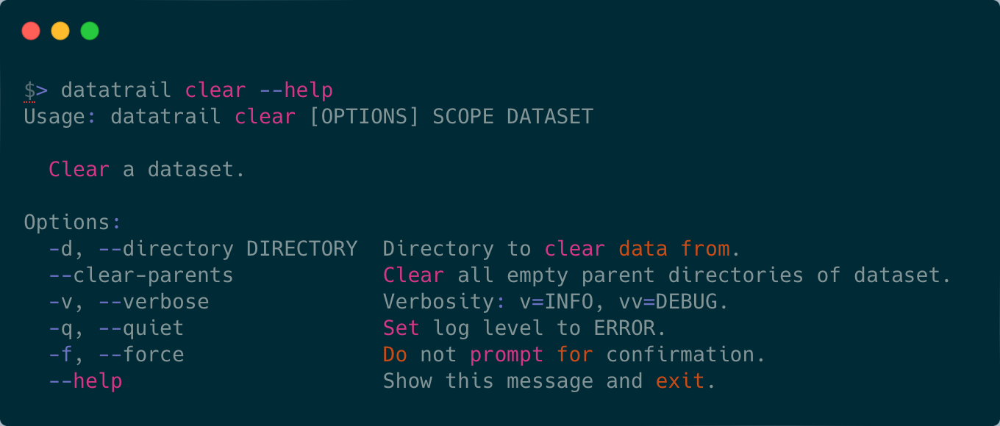

# 🗑️ Removing a dataset with `clear`



Once you have completed your analysis, or no longer have need of a dataset, you
can remove it with `datatrail clear`. This will remove the common path of all
of the downloaded files, typically "astro_xxxxxxxx" for baseband datasets.
However, during the download, parent directories would've also been created,
to remove these you can use the `--clear-parents` flag. Like `pull`, `clear`
will ask for confirmation before removing the dataset.

=== "Default"
    ```shell
    $> datatrail clear kko.event.baseband.raw 308892599

    Searching for files for 308892599 kko.event.baseband.raw...
    
    Directory: ./data/kko/baseband/raw/2023/08/07/astro_308892599
     - Found 4 files.
     - Total size: 0.02 GB.
    
    ⚠️  Delete files? [y/n]: y
    ```

=== "With --clear-parents"

    ```shell
    datatrail clear kko.event.baseband.raw 308892599 --clear-parents
    
    Searching for files for 308892599 kko.event.baseband.raw...
    
    Directory: ./data/kko/baseband/raw/2023/08/07/astro_308892599
     - Found 9 files.
     - Total size: 0.04 GB.
    
    ⚠️  Delete files and empty parent directories? [y/n]: y
    ```

!!! danger "Warning: Modified download paths (`--directory`)"

    If you'd downloaded a dataset to a different directory than the root
    mount for your site, you'll need to use the `--directory` flag with
    same value.

!!! tip "Verbosity: More insight"

    ```shell
    $> datatrail clear kko.event.baseband.raw 308892599 --clear-parents -vv
    [17:13:28] DEBUG    `clear` called with:                         
               DEBUG    scope: kko.event.baseband.raw [<class 'str'>]
               DEBUG    dataset: 308892599 [<class 'str'>]           
               DEBUG    directory: None [<class 'NoneType'>]         
               DEBUG    clear_parents: True [<class 'bool'>]         
               DEBUG    verbose: 2 [<class 'int'>]                   
               DEBUG    quiet: False [<class 'bool'>]                
               DEBUG    Loading configuration.                       
               DEBUG    Site set to: local                           
               INFO     No directory, setting to: ./                 
    
    Searching for files for 308892599 kko.event.baseband.raw...
    
               DEBUG    Loading configuration.                                               
               DEBUG    Server: https://frb.chimenet.ca/datatrail                            
               DEBUG    Configuration loaded successfully.                                   
               INFO     Querying Datatrail for 308892599 kko.event.baseband.raw.             
               DEBUG    URL: https://frb.chimenet.ca/datatrail/query/dataset/find            
    Directory: ./data/kko/baseband/raw/2023/08/07/astro_308892599
     - Found 2 files.
     - Total size: 0.01 GB.
    
    ⚠️  Delete files and empty parent directories? [y/n]: y
    [17:13:34] DEBUG    clear_parents: True                                                  
               DEBUG    Checking if path ./data/kko/baseband/raw/2023/08/07/astro_308892599  
                        exists.
               INFO     Path successfully removed.                                           
               DEBUG    Clearing parent directories of data/kko/baseband/raw/2023/08/07.     
               DEBUG    files: []                                                            
               DEBUG    data/kko/baseband/raw/2023/08/07: ✔ # (1)!                                 
               DEBUG    files: []                                                            
               DEBUG    data/kko/baseband/raw/2023/08: ✔                                     
    [17:13:35] DEBUG    files: []                                                            
               DEBUG    data/kko/baseband/raw/2023: ✔                                        
               DEBUG    files: []                                                            
               DEBUG    data/kko/baseband/raw: ✔                                             
               DEBUG    files: []                                                            
               DEBUG    data/kko/baseband: ✔                                                 
               DEBUG    files: []                                                            
               DEBUG    data/kko: ✔                                                          
               DEBUG    files: []                                                            
               DEBUG    data: ✔                                                              
               DEBUG    files: [PosixPath('.DS_Store'), PosixPath('mkdocs.yml'),             
                        PosixPath('LICENSE'), PosixPath('.pytest_cache'),
                        PosixPath('CHANGELOG.md'), PosixPath('.pre-commit-config.yaml'),
                        PosixPath('dtcli'), PosixPath('pyproject.toml'), PosixPath('tests'),
                        PosixPath('docs'), PosixPath('README.md'), PosixPath('.gitignore'),
                        PosixPath('.github'), PosixPath('tox.ini'),
                        PosixPath('poetry.lock'), PosixPath('.git')]
               DEBUG    .: ✗ # (2)!
    ```

    1. `--clear-parents` checks if each successive parent directory is empty before deleting it.
    2. If files are found in a parent directory, it is _NOT_ deleted.
