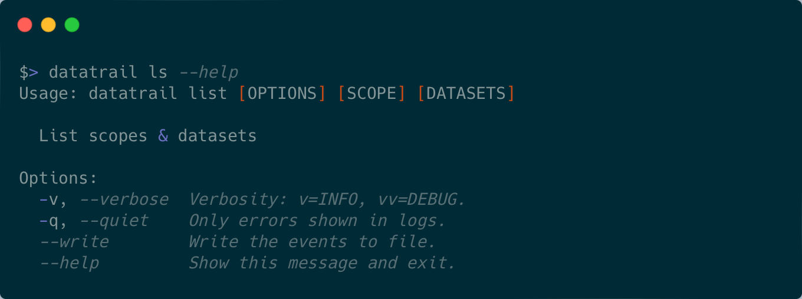

# 🗒️ Finding scopes and datasets with `list`



Datasets in Datatrail are identified by the unique combination of a 'scope' and
a 'dataset name'. A scope gives an indication of site that the data was captured
at and the type of data product that the dataset contains. For example, the
scope 'kko.scheduled.baseband.raw' contains datasets captured at the KKO
outrigger and that are manually triggered baseband dumps.

Within Datatrail, there are two types of datasets:

- **Larger datasets** - are datasets that contain other datasets, but no files.
- **Datasets** - are datasets that are attached to files.

!!! note "Scopes"

    A list of all scopes in the Datatrail database can be obtained by the
    following command:

    ```shell
    $> datatrail ls
            Datatrail: Scopes
    ┏━━━━━━━━━━━━━━━━━━━━━━━━━━━━━━━┓
    ┃ Scopes                        ┃
    ┡━━━━━━━━━━━━━━━━━━━━━━━━━━━━━━━┩
    │ chime.event.baseband.raw      │
    │ chime.event.intensity.raw     │
    │ kko.acquisition.processed     │
    │ kko.calibration.trackingbeam  │
    │ kko.event.baseband.beamformed │
    │ kko.event.baseband.processed  │
    │ kko.event.baseband.raw        │
    │ kko.scheduled.baseband.raw    │
    └───────────────────────────────┘
    ```

!!! note "Larger datasets with a scope"

    A list of all larger datasets for a given scope in the Datatrail database
    can be obtained by the following command:

    ```shell
    $> datatrail ls kko.scheduled.baseband.raw
               Datatrail: Larger Datasets
               kko.scheduled.baseband.raw
    ┏━━━━━━━━━━━━━━━━━━━━━━━━━━━━━━━━━━━━━━━━━━━━━━┓
    ┃               Larger datasets                ┃
    ┡━━━━━━━━━━━━━━━━━━━━━━━━━━━━━━━━━━━━━━━━━━━━━━┩
    │                20230804095251                │
    │        scheduled.commissioning.steady        │
    └──────────────────────────────────────────────┘
    (END)
    
    ```

!!! note "Datasets within a larger dataset"

    A list of all datasets within a larger dataset in the Datatrail database
    can be obtained by the following command:

    ```shell
    Datatrail: Child Datasets scheduled.commissioning.steady kko.scheduled.baseband.raw
    ┏━━━━━━━━━━━━━━━━━━━━━━━━━━━━━━━━━━━━━━━━━━━━━━━━━━━━━━━━━━━━━━━━━━━━━━━━━┓
    ┃                                Datasets                                 ┃
    ┡━━━━━━━━━━━━━━━━━━━━━━━━━━━━━━━━━━━━━━━━━━━━━━━━━━━━━━━━━━━━━━━━━━━━━━━━━┩
    │    20230616150511  20230604135840  20230604134842    20230604131847     │
    │    20230604130848  20230604125850  20230604124851    20230604123853     │
    │    20230604120858  20230603081533  20230603080535    20230603075536     │
    │    20230603072541  20230603071543  20230603070544    20230603065546     │
    │    20230603062551  20230601082325  20230601081326    20230601080328     │
    │    20230601073333  20230601072335  20230601071336    20230601070338     │
    │    20230601063343  20230531124438  20230531123440    20230524142031     │
    │    20230524135029  20230524134028  20230524133027    20230524132026     │
    │    20230524125024  20230524124023  20230524123022    20230523124023     │
    │    20230522074031  20230522073030  20230522072029    20230522071028     │
    │    20230522064025  20230522063024  20230522062023    20230522061022     │
    │    20230521074031  20230521073030  20230521072029    20230521071028     │
    │    20230521064025  20230521063024  20230521062023    20230521061023     │
    │    20230519094030  20230519093029  20230519092028    20230519091027     │
    │    20230519084025  20230519083024  20230519082023    20230519081022     │
    │    20230518030521  20230518024523  20230518024022    20230518023522     │
    :
    ```

!!! abstract "More information"

    Please see the CLI reference page for more information on the `list` command:
    [datatrail list](../cli/#datatrail-list)
