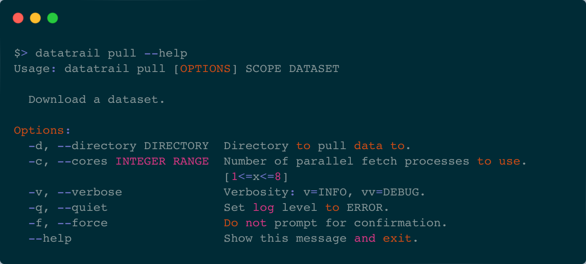

# ⬇️  Downloading a dataset with `pull`

!!! warning "Requires a valid CADC certificate"

    Downloading datasets requires a valid CADC certificate and the relevant
    permissions on CANFAR.



To download a dataset from MINOC, we use `datatrail pull`. Without any flags,
this starts a single process to download the dataset. However, if you have
multiple cores, you can start multiple processes to download the dataset
faster. To start multiple processes, use the `--cores` flag, the help will
indicte how many cores are availble.

If you'd like to download a dataset to a different directory than the root
mount for your site, you can use the `--directory` flag. Note, that this
also affects the check for existing files.

=== "Single process download"

    ```shell
    $> datatrail pull kko.event.baseband.raw 308892599 # (1)!

    Searching for files for 308892599 kko.event.baseband.raw...
    
     - 0 files found at local. # (2)!
     - 1024 files can be downloaded from minoc. # (3)!
         - Size to download: 5.34 GB.
    
    Download 1024 files? [y/n]: y # (4)!
    1024 files missing.
    Downloading 1024 missing files.
    ```

    1. The `--cores` flag can be used to download multiple files simultaneously.
    The number of cores that can be set is limited by the host machine.
    2. If files belonging to the dataset already exist and are found they are
    not re-downloaded.
    3. Remaining files that were not found locally are availble to download and
    their size is calculated.
    4. Confirming with `y` will start the download. This can be skipped by adding
    the `--force` flag.

=== "Multi process download"

    ```shell
    $> datatrail pull kko.event.baseband.raw 308892599 --cores 4  # (1)!

    Searching for files for 308892599 kko.event.baseband.raw...
    
     - 0 files found at local. # (2)!
     - 1024 files can be downloaded from minoc. # (3)!
         - Size to download: 5.34 GB.
    
    Download 1024 files? [y/n]: y # (4)!
    1024 files missing.
    Downloading 1024 missing files.
    ```

    1. The `--cores` flag can be used to download multiple files simultaneously.
    The number of cores that can be set is limited by the host machine.
    2. If files belonging to the dataset already exist and are found they are
    not re-downloaded.
    3. Remaining files that were not found locally are availble to download and
    their size is calculated.
    4. Confirming with `y` will start the download. This can be skipped by adding
    the `--force` flag.

!!! tip "View progress"

    By default, there is no progress indicator while downloading a dataset. If
    you'd like to reassure yourself that something is happening, you can add
    verbosity to see the current file being downloaded.

    ```shell
    $> datatrail pull kko.event.baseband.raw 308892599 -vv --force
    [16:48:37] DEBUG    `pull` called with:                                                  
               DEBUG    scope: kko.event.baseband.raw [<class 'str'>]                        
               DEBUG    dataset: 308892599 [<class 'str'>]                                   
               DEBUG    verbose: 2 [<class 'int'>]                                           
               DEBUG    quiet: False [<class 'bool'>]                                        
               DEBUG    Loading config.                                                      
               DEBUG    Site set to: local.                                                  
               INFO     No directory, setting to: ./.                                        
    
    Searching for files for 308892599 kko.event.baseband.raw...
    
               INFO     Finding files for 308892599 in kko.event.baseband.raw.               
               DEBUG    Payload: {'scope': 'kko.event.baseband.raw', 'name': '308892599'}    
               DEBUG    URL: https://frb.chimenet.ca/datatrail/query/dataset/find            
    [16:48:40] DEBUG    Status: 200.                                                         
               DEBUG    Decoding response.                                                   
               INFO     Checking for local copies of files.                                  
               DEBUG    -                                                                    
                        data/kko/baseband/raw/2023/08/07/astro_308892599/baseband_308892599926.h5 : ✘
    ... # (1)!
     - 1 files found at local.
     - 1023 files can be downloaded from minoc.
         - Size to download: 5.34 GB.
    
    1023 files missing.
    Downloading 1023 missing files.
               INFO     Starting 1 processes.                                               
    [16:48:44] INFO     Connecting to CADC...                                               
               DEBUG    Checking source and destination length match.                       
               DEBUG    Source length: 1023                                                 
               DEBUG    Destination length: 1023                                            
    [16:48:47] DEBUG    cadc:CHIMEFRB/data/kko/baseband/raw/2023/08/07/astro_308892599/base 
                        band_308892599_926.h5 ➜
                        ./data/kko/baseband/raw/2023/08/07/astro_308892599/baseband_3088925
                        99_926.h5 ✔
    [16:48:51] DEBUG    cadc:CHIMEFRB/data/kko/baseband/raw/2023/08/07/astro_308892599/base 
                        band_308892599_129.h5 ➜
                        ./data/kko/baseband/raw/2023/08/07/astro_308892599/baseband_3088925
                        99_129.h5 ✔
    ```

    1. Note: You will also see all of the output that checks if the files already exist.
    Truncated for clarity here.
